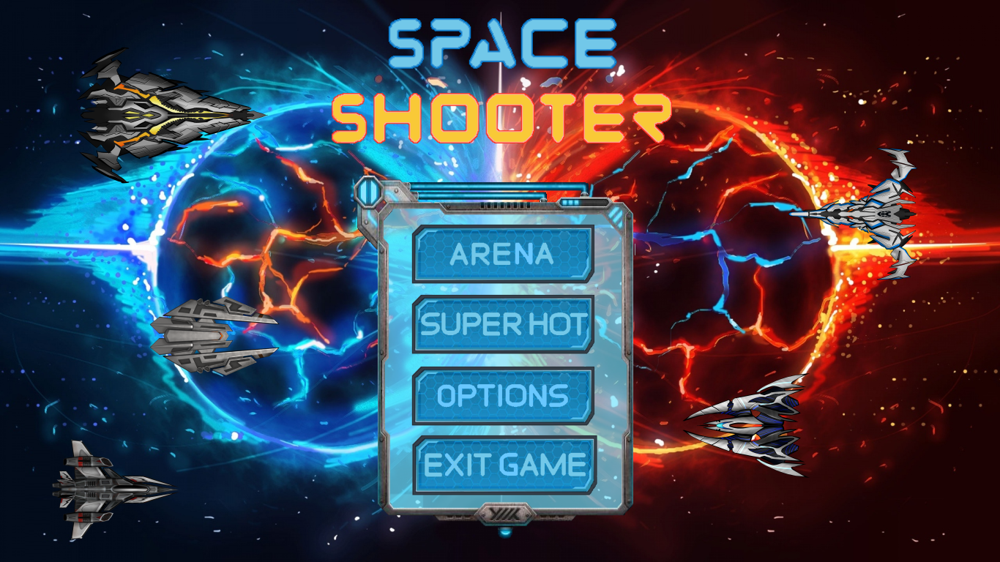

<!-- PROJECT LOGO -->
 

  
  <h3 align="center">Space Shooter</h3>
  

     Final school assignment of our choise
  

<!-- ABOUT THE PROJECT -->
## About The Project

Action-survival, singlplayer / multiplayer game that is a competition between spaceships. Each player chooses a spaceship with the desired specifications such as ship speed, laser speed, reloading. The keyboard controls that will control the spaceship are also selected. The object of the game is to encourage the fighting spirit in the players and to reward the winner.
### Two options for playing

1. Arena: multiplayer option, a match between heroes and foes who need to achieve the highscore. You can play as humans or bots and the maximum number of players is six.

2. SUPER HOT: singlplayer option, survival mode in which a player plays against AI spaceships, time goes along with the player, if the player stands still the time freezes.

<!-- LICENSE -->
## License

Distributed under the MIT License. See `LICENSE` for more information.

<!-- CONTACT -->
## Contact

Vase Trendafilov - [@TrendafilovVase](https://twitter.com/TrendafilovVase) - vasetrendafilov@gmail.com

Project Link: [https://github.com/vasetrendafilov/space-fighters](https://github.com/vasetrendafilov/space-fighters)
